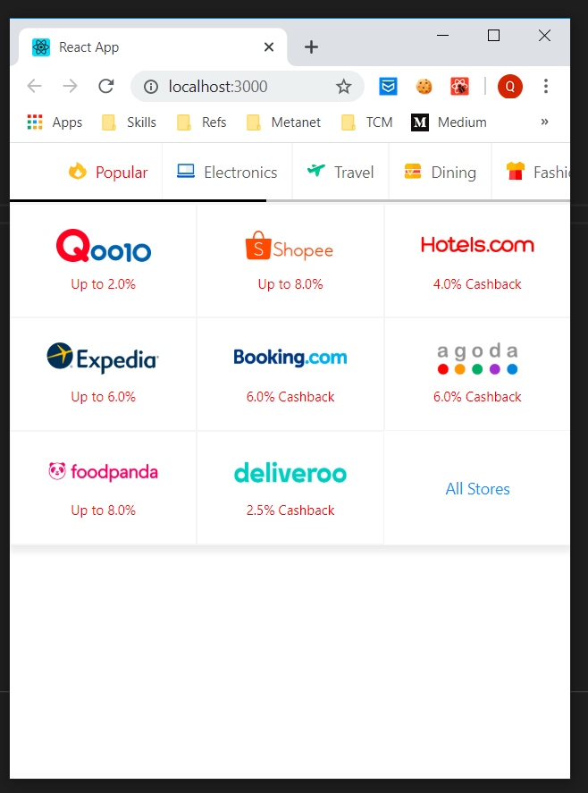

# Shopback Assignment 

Implement an functional list of Merchant by Category

## Getting Started

### Prerequisites

You need to install yarn > 1.2 and npm 6.x.x

### Installing

```
yarn
yarn start
```
After run all above commands. Access to application by url: 
http://localhost:3000

You will see the application show as below pictures (Mobile and Desktop version)





## Running the tests

If you want to run test for this application. Just type:

```yarn test ```

## Authors

* **Trương Quang Khải** - *truongqk1987@gmail.com* - [Github Repositories](https://github.com/truongqk1987)

